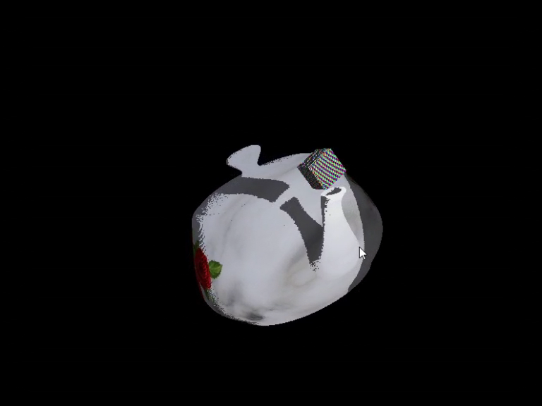

A non‑polygon‑based graphics engine written in Rust using SDL2 and WGPU.

Just pull the code and run with:  
`cargo run --release`

 
Demo: https://drive.google.com/file/d/12gd-R1CQ-atdvcHmsXghGv22BQgWU_ba/view?usp=drivesdk

 
 
<h3>Sponsorship</h3>

Ethereum: `0x53A6F9c6a717d5012629564c864f07330909bBA8`
